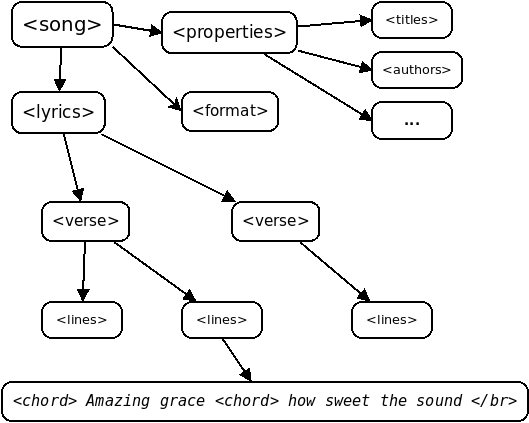

KMP Xml parser sample for [openlyrics](https://openlyrics.org/)
===============================================================

### Preamble
_Template generated at https://kmp.jetbrains.com/_

This is a Kotlin Multiplatform project targeting Android, iOS, Desktop.

* `/composeApp` is for code that will be shared across your Compose Multiplatform applications.
  It contains several subfolders:
  - `commonMain` is for code that’s common for all targets.
  - Other folders are for Kotlin code that will be compiled for only the platform indicated in the folder name.
    For example, if you want to use Apple’s CoreCrypto for the iOS part of your Kotlin app,
    `iosMain` would be the right folder for such calls.

* `/iosApp` contains iOS applications. Even if you’re sharing your UI with Compose Multiplatform, 
  you need this entry point for your iOS app. This is also where you should add SwiftUI code for your project.


Learn more about [Kotlin Multiplatform](https://www.jetbrains.com/help/kotlin-multiplatform-dev/get-started.html)…

#### [XmlUtil](https://github.com/pdvrieze/xmlutil)
xmlutil is an open source [XML](https://en.wikipedia.org/wiki/XML) serialization library for kotlin with KMP support.

#### [openlyrics](https://openlyrics.org/)
_OpenLyrics is a free, open XML standard for Christian worship songs. The goal of OpenLyrics is to provide an application-independant and operating system-independant song format for interoperability between applications._
Basic format of openlyrics is shown



#### Compose multiplatform
This project builds on the previous one which [can be found here](https://github.com/odifek/Bundled_Asset) 

Additionally, we now use [compose multiplatform](https://www.jetbrains.com/lp/compose-multiplatform/) with the project template generated [here](https://kmp.jetbrains.com/)

### The code
The first thing is to create the model based on the xml format you want to parse. 
Sample openlyrics xml

```xml
<song xmlns="http://openlyrics.info/namespace/2009/song"
      version="0.9">
  <properties>
    <titles>
      <title>Amazing Grace</title>
    </titles>
  </properties>
  <lyrics>
    <verse name="v1">
      <lines>
        Amazing grace how sweet the sound
      </lines>
    </verse>
  </lyrics>
</song>
```
The root is `song` so we define our model as

```kotlin
@Serializable
@XmlSerialName(value = "song")
data class OpenLyricsSong
```

Then we decode the xml content by invoking `decodeFromString` on an already created `XML` instance. 
```kotlin
val xml: XML by lazy {
        XML {
            xmlVersion = XmlVersion.XML10
            xmlDeclMode = XmlDeclMode.Auto
            indentString = "  "
            repairNamespaces = true
        }
}
```

```kotlin
val openLyricsSong = xml.decodeFromString(
    deserializer = OpenLyricsSong.serializer(), // 1..
    string = lyricsXmlContent
         .replace("<br/>", "\n"), // 2..
    rootName = QName("http://openlyrics.info/namespace/2009/song", "song"), // 3..
)
```
1. The model is marked `Serializable` thus kotlin serialization is able to generate the serializer for us.
2. Replace line breaks with newline characters
3. It's important to specify the namespace for the xml you want to parse.

I would show the entire model and briefly explain the important parts

```kotlin
//... imports

@Serializable
@SerialName("song") // 1..
@XmlSerialName(value = "song") // 2..
data class OpenLyricsSong(
    // Metadata
    val lang: String = "en",
    val chordNotation: String = "english",
    val version: String = "0.9", // open lyrics version
    val properties: Properties,
    @XmlChildrenName("verse") // 3..
    val lyrics: List<Verse>,
) {
    @Serializable
    @SerialName("properties")
    data class Properties(
        @XmlChildrenName("title")
        val titles: List<Title>,
        @XmlChildrenName("author")
        val authors: List<Author>? = null,
        @XmlChildrenName("songbook")
        val songbooks: List<Songbook>? = null,
        @XmlElement
        val verseOrder: String? = null,
        @XmlElement
        val copyright: String? = null,
        @XmlElement
        val publisher: String? = null,
    )

    @Serializable
    data class Author(
        @XmlValue val value: String, // 4..
        val type: String? = null,
        val comment: String? = null,
    )

    @Serializable
    data class Title(
        @XmlValue val value: String,
    )

    @Serializable
    data class Songbook(
        val name: String,
        val entry: String? = null,
    )

    @Serializable
    @XmlSerialName("verse")
    @SerialName("verse")
    data class Verse(
        val name: String,
        val lines: List<Lines>,
    )

    @Serializable
    @SerialName("lines")
    // Workaround for issue https://github.com/pdvrieze/xmlutil/issues/194 
    @XmlSerialName("lines", namespace = "http://openlyrics.info/namespace/2009/song") // 5..
    data class Lines(
        @XmlValue val content: String,
    )
}
```

1. `SerialName` is a kotlin serialization annotation. You can use this to provide an alternate name for the xml tag.
2. `XmlSerialName` is an xmlutil annotation. You can use this to customise the xml tag. If your model doesn't require further customisation, you can omit it and use just `SerialName`
3. `XmlChildrenName` is used on a list if the contents of the list are sub-children of the root tag. For example here, verses are wrapped in lyrics tags.
   This is expected
```xml
<song>
  <lyrics>
    <verse name="v1">
      <lines>First line of first verse.</lines>
    </verse>
    <verse name="v2">
      <lines>First line of second verse.</lines>
    </verse>
  </lyrics>
</song>
```
Instead of
```xml

<song>
  <verse name="v1">
    <lines>First line of first verse.</lines>
  </verse>
  <verse name="v2">
    <lines>First line of second verse.</lines>
  </verse>
</song>
```
4. `XmlValue` is an annotation used to force the parameter to a value as by default it would be taken as a property. 
If we omit the `XmlValue` annotation in Author, we would have `<author value="Author name">` instead of `<author>Author name</author>`.
5. A workaround for issue I discovered. The issue is reported [here](https://github.com/pdvrieze/xmlutil/issues/194)

### Summary
With the aid of xmlutil and some customisation, we are able to parse (and generate) openlyrics XML. 
The good thing about this is that the solution is multiplatform - it works for both Android, iOS and desktop. Haven't tried this on Web/Wasm though. 
To see the full code at work and how it is integrated in a compose multiplatform app, [please see the sample project](https://github.com/odifek/XmlParserSample)
I hope you liked the short article/recipe. 
And please like, share and subscribe.

Link to sample project: https://github.com/odifek/XmlParserSample